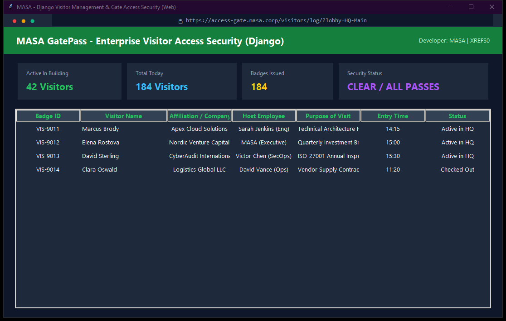

# Enterprise Visitor Registration & Gate Access Pass

Corporate reception and physical security software developed in Django, generating visitor badges, logging entry/exit timestamps, managing host employee approvals, and security alerts.

---

## Preview



---

## Technical Specifications

- **Language**: Python 3.11+
- **Architecture**: Modular Django Web Architecture (MVT)
- **Technologies**: Django 4+, SQLite, Bootstrap 5, Python 3.11
- **Lead Developer**: MASA
- **License**: MIT (Licensed to XREFS0)

---

## Key Features

- **Enterprise Reliability**: Clean separation between models, views, templates, and database storage.
- **Robust Persistence**: Engineered with structured migrations, transactional data safety, and schema integrity.
- **Developer-Centric Codebase**: Strict PEP 8 styling formatted with Black, comment-free production code.
- **Modern Security**: CSRF protection, secure authentication backends, and sanitized input validation.

---

## Installation & Setup

1. **Clone the repository**:
   ```bash
   git clone https://github.com/XREFS0/masa-django-visitor-mgmt.git
   cd masa-django-visitor-mgmt
   ```

2. **Set up virtual environment (optional but recommended)**:
   ```bash
   python -m venv venv
   source venv/bin/activate  # On Windows: venv\Scripts\activate
   ```

3. **Install dependencies**:
   ```bash
   pip install django pillow
   ```

4. **Apply database migrations**:
   ```bash
   python manage.py migrate
   ```

5. **Launch the web application**:
   ```bash
   python manage.py runserver
   ```

---

## Author & Copyright

- **Developer**: MASA
- **Copyright**: (c) 2026 XREFS0. All rights reserved under the MIT License.
